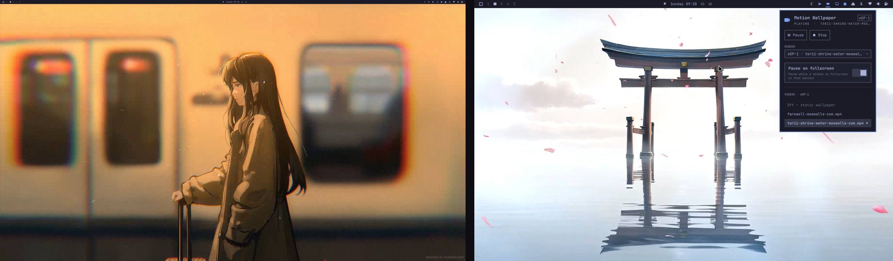
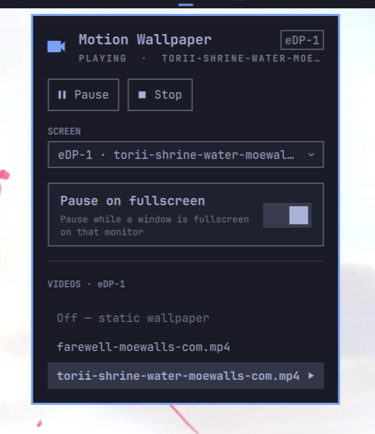

# Motion Wallpaper - Omarchy

Animated video wallpapers for [Omarchy 4](https://omarchy.com) (Arch Linux + Hyprland + Quickshell).



<sub>Two monitors, two different clips, panel open on the right. Clips from [moewalls.com](https://moewalls.com).</sub>

Drop some clips in `~/Videos`, click the film icon in the bar, pick one. That's it.

- **A different clip on every monitor** — or one everywhere, or video on some screens and your normal wallpaper on the rest
- **Native panel in the bar** — play, pause, stop, pick a clip, all themed to match the rest of the shell
- **Pauses itself** under fullscreen windows, so games and films don't pay for a wallpaper nobody can see
- **Cross-fades** between clips — the desktop never flashes through mid-switch
- **Comes back after a reboot**, with no autostart to set up
- **`motion-wallpaper` CLI** for keybinds and scripting

There's no daemon, watcher, systemd unit or terminal UI — it is one omarchy-shell plugin doing the rendering, the controls and the state.

> **Omarchy 4+ only.** It needs the Quickshell-based `omarchy-shell`; the installer checks for it and stops if it is missing.

[](https://youtu.be/GpdS_jyW9kU)

## Quick Start

This repo is an Omarchy shell plugin, so Omarchy's own plugin command installs it:

```bash
omarchy plugin add https://github.com/28allday/Motion-Wallpaper-Omarchy.git --enable
```

That clones it into `~/.config/omarchy/plugins/`, enables it, and asks which bar section to put the film icon in — left, center or right (right is pre-selected). Click the icon and pick a video: that is the whole install.

To also get the `motion-wallpaper` CLI (for keybinds and scripting), the Walker entry and the icon, run the installer script as well:

```bash
git clone https://github.com/28allday/Motion-Wallpaper-Omarchy.git
cd Motion-Wallpaper-Omarchy
./wallpaper.sh
```

`wallpaper.sh` checks dependencies, installs the plugin if it isn't already there (asking where to put the bar icon, same as above), installs the CLI and icon, and restarts the shell. If you already have the plugin, it leaves it alone and just adds the CLI.

To update later:

```bash
omarchy plugin update nosignal.motion-wallpaper
```

## Requirements

- **OS**: [Omarchy 4](https://omarchy.com)+ (Arch Linux) with **omarchy-shell** (Quickshell)
- **Compositor**: Hyprland
- **Packages**: `qt6-multimedia` (video decode), `jq`, `python`, `hyprland` — installed automatically if missing (no AUR helper needed)

## What It Installs

| Path | Purpose |
|------|---------|
| `~/.config/omarchy/plugins/nosignal.motion-wallpaper/` | the plugin (service + bar widget + panel) |
| `~/.local/bin/motion-wallpaper` | CLI control (keybinds / scripting) |
| `~/.local/share/applications/motion-wallpaper.desktop` | Walker entry (toggles the wallpaper) |
| `~/.local/share/icons/hicolor/scalable/apps/motion-wallpaper.svg` | icon |

In your `shell.json`, enabling adds a single bar-widget entry in the section you chose. Out of the box the plugin starts with no video selected, so your normal static wallpaper is what you see until you pick a clip.

### Setting defaults in `shell.json`

Optional. Add an entry for this plugin id under `plugins[]` to choose what it starts with:

```json
{ "id": "nosignal.motion-wallpaper", "videoPath": "~/Videos/clip.mp4",
  "enabled": true, "output": "all", "pauseOnFullscreen": true }
```

To start each monitor on its own clip, add `screenVideos`, keyed by connector
name (`hyprctl monitors` lists them). An empty string keeps that screen on the
static wallpaper, and any monitor you don't list falls back to `videoPath`:

```json
{ "id": "nosignal.motion-wallpaper",
  "videoPath": "~/Videos/clip.mp4",
  "screenVideos": { "DP-1": "~/Videos/rain.mp4", "DP-2": "" },
  "enabled": true, "pauseOnFullscreen": true }
```

## Usage

### The bar widget + panel



Click the **film icon** in the bar to open the control panel. From there you can:

- **Play / Pause / Stop** the video
- **Pick a clip** from a list of the videos in `~/Videos` — clips cross-fade into each other, so the desktop never flashes through mid-switch
- **Choose the screen** — the **SCREEN** dropdown (only shown when you have more than one monitor) aims everything below it: leave it on *All screens* to set every monitor at once, or pick a monitor to change just that one. Each option is labelled with the clip that screen is playing, so the dropdown doubles as the per-monitor readout.
- **Toggle auto-pause** when a fullscreen window covers the wallpaper

The bar icon reflects state at a glance: accent when playing, amber when paused, dim when stopped.

### From the terminal

```bash
motion-wallpaper                 # print current state, per monitor (default)
motion-wallpaper screens         # what each monitor is showing
motion-wallpaper play ~/Videos/clip.mp4          # every monitor
motion-wallpaper play ~/Videos/rain.mp4 DP-1     # just that monitor
motion-wallpaper off DP-2        # blank one screen; the others keep playing
motion-wallpaper clear DP-1      # drop its own clip; follow the default again
motion-wallpaper stop            # stop everywhere; static wallpaper shows through
motion-wallpaper toggle          # flip on/off
motion-wallpaper pause           # pause / resume
motion-wallpaper resume
motion-wallpaper autopause off   # or: on
```

### With a keybind

Omarchy 4 keeps user keybinds in `~/.config/hypr/bindings.lua`. Avoid `SUPER+W` — that's *Close window* in Omarchy:

```lua
-- flip the wallpaper on and off
o.bind("SUPER + ALT + W", "Motion wallpaper", "motion-wallpaper toggle")

-- or open the panel itself
o.bind("SUPER + ALT + V", "Motion wallpaper panel",
       "omarchy-shell shell toggle nosignal.motion-wallpaper")
```

### Video library folder

Drop clips in **`~/Videos`** and they appear in the panel's list (a `~/Videos/Wallpapers` subfolder is picked up too). To play a file from anywhere else, use `motion-wallpaper play <path>`.

### Multiple monitors

Every monitor is set independently, so you can run **a different clip on each screen**, the same clip on all of them, or video on some and the static wallpaper on the rest. It all applies live, with no shell restart.

From the panel: pick a monitor in the **SCREEN** dropdown, then click a clip — only that screen changes. With a monitor picked, the video list grows an **Off — static wallpaper** row that blanks that one screen while the others keep playing. Switch back to *All screens* and clicking a clip sets every monitor at once (dropping the per-screen choices).

Once your screens are set individually, the panel **opens aimed at the monitor it is on** rather than at *All screens* — so a stray click changes one screen instead of flattening the lot. The screen it is aimed at is named in the pill next to the title.

The same thing from the terminal:

```bash
motion-wallpaper play ~/Videos/rain.mp4 DP-1
motion-wallpaper play ~/Videos/city.mp4 HDMI-A-1
motion-wallpaper off DP-2
motion-wallpaper screens          # check what landed where
```

Connector names come from `hyprctl monitors`. A monitor keeps its clip while it is unplugged, so it comes back to the right one; a monitor you have never set follows the default `videoPath` (and the legacy `motion-wallpaper screen <name|all>` targeting, which only applies to monitors with no clip of their own).

### Persistence

A playing wallpaper **resumes automatically after a reboot** — the plugin persists its state to `~/.local/state/motion-wallpaper/state.json` and the shell loads it on login. There's no separate autostart step: `stop` means it stays off next boot, `play` means it comes back.

## How It Works

- **Rendering** — the plugin creates one `PanelWindow` per targeted monitor on the Wayland **background layer** (namespace `omarchy-motion-background`), using QtMultimedia `MediaPlayer` + `VideoOutput` (looped, muted, `PreserveAspectCrop`). Each surface resolves its own clip, which is what lets monitors differ. It loads after the first-party static-wallpaper surface, so it stacks above it. When a monitor has no video set or its file is missing, no surface is created there at all — so the static wallpaper shows through (never a black or frozen frame).
- **Auto-pause on fullscreen** — the plugin listens to Hyprland's event stream (`Quickshell.Hyprland`) and, on any fullscreen-affecting event, reads per-monitor ground truth from `hyprctl` to pause the video on exactly the monitor whose visible workspace has a fullscreen window. Toggle it from the panel (or `motion-wallpaper autopause on|off`).
- **Theme changes** — nothing to do: switch themes freely, the first-party static wallpaper updates underneath. The video keeps playing until you stop it.
- **Controls** — the bar widget and panel talk to the plugin's service instance in-process. The `motion-wallpaper` CLI is a thin client over the same shell IPC target (`play` / `playAll` / `playOn` / `clearScreen` / `stop` / `toggle` / `pause` / `resume` / `status` / `screens` / `setOutput` / `setPauseOnFullscreen`), reachable directly as `omarchy-shell motion-wallpaper <fn>`. State (per-screen clips, default video, enabled, auto-pause) persists to `~/.local/state/motion-wallpaper/state.json`.

## Supported Video Formats

Anything QtMultimedia's FFmpeg backend can decode — `.mp4`, `.m4v`, `.mkv`, `.webm`, `.mov`, `.avi`. H.264/H.265 MP4 is the safest bet for smooth looping.

## Finding Video Wallpapers

- [MoeWalls](https://moewalls.com) — large library of looping anime/aesthetic clips
- Any short, seamlessly-looping video works well; keep it at your display resolution to avoid needless GPU scaling.

## Performance

Video wallpaper decodes continuously on the GPU, so it uses more power than a static image. The fullscreen auto-pause keeps games and full-screen video from paying that cost. For laptops on battery, consider `motion-wallpaper stop` or a shorter/lower-bitrate clip.

## Troubleshooting

- **No bar icon / "plugin isn't loaded"** — make sure it is enabled (`omarchy plugin enable nosignal.motion-wallpaper`), then restart the shell with `omarchy-restart-shell`. Confirm the IPC target answers with `omarchy-shell motion-wallpaper status`.
- **No video appears** — check `motion-wallpaper status`: `videoFileExists: false` means the saved path is gone; pick a new file. Watch for QML errors in the shell's journal.
- **Edited the plugin QML** — plugin code changes need a full `omarchy-restart-shell`; `ipc call shell rescanPlugins` only *discovers* newly-added plugins, it doesn't reload edited code. Don't use `omarchy-refresh-shell` — it resets `shell.json`.
- **Logs** — `~/.cache/motion-wallpaper.log` (CLI) and the shell's own stderr/journal (plugin).

## Uninstalling

```bash
motion-wallpaper stop
omarchy plugin remove nosignal.motion-wallpaper

# The extras the plugin command doesn't own:
rm -f  ~/.local/bin/motion-wallpaper \
       ~/.local/share/applications/motion-wallpaper.desktop \
       ~/.local/share/icons/hicolor/scalable/apps/motion-wallpaper.svg
rm -rf ~/.local/state/motion-wallpaper
```

## Credits

Built for [Omarchy](https://omarchy.com) by DHH and the Omarchy community. Video playback via [Qt Multimedia](https://doc.qt.io/qt-6/qtmultimedia-index.html); shell integration via [Quickshell](https://quickshell.outfoxxed.me/).

## License

MIT
